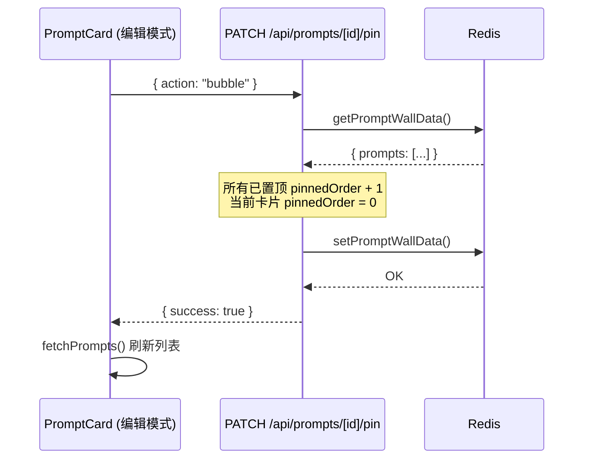

## Product Overview

为 Prompt Wall 添加卡片置顶功能，并将布局从瀑布流改为逐行填充的网格布局。

## Core Features

- **置顶/冒泡操作**：仅在编辑模式下可见两个按钮。「置顶」将卡片追加到置顶列表末尾；「冒泡」将卡片插入置顶列表最前，其余置顶卡片顺序后移一位
- **取消置顶**：已置顶的卡片在编辑模式下显示「取消置顶」按钮（替代置顶/冒泡）
- **置顶排序**：API 返回时自动排序 — 已置顶卡片按 pinnedOrder 升序排列在前，未置顶卡片按 createdAt 降序在后
- **网格布局**：用 CSS Grid 替代 CSS multi-column 瀑布流，卡片按行从左到右填充（index % columnCount 分配到对应列），单列模式时退化为单列纵向排列

## Tech Stack

- 现有技术栈：Next.js + TypeScript + Tailwind CSS + shadcn/ui + lucide-react + Upstash Redis
- 无需引入新依赖

## Implementation Approach

### 数据模型

在 `Prompt` 接口新增可选字段 `pinnedOrder?: number`。`undefined` 表示未置顶；`0, 1, 2...` 表示置顶顺序（0 最前）。

### 排序策略

排序逻辑放在 API GET 端点（无状态排序，不改动 Redis 存储顺序）：

```
prompts.sort((a, b) => {
  const aPinned = a.pinnedOrder ?? Infinity;
  const bPinned = b.pinnedOrder ?? Infinity;
  if (aPinned !== bPinned) return aPinned - bPinned;
  return new Date(b.createdAt).getTime() - new Date(a.createdAt).getTime();
});
```

### 置顶/冒泡 API

新增 `PATCH /api/prompts/[id]/pin` 端点，接受 `action: 'pin' | 'bubble' | 'unpin'`。

- **pin**：该卡片 pinnedOrder = 当前所有已置顶卡片的最大 pinnedOrder + 1
- **bubble**：所有已置顶卡片的 pinnedOrder + 1，该卡片 pinnedOrder = 0
- **unpin**：该卡片 pinnedOrder = undefined

这是单次批量写入，避免多次 PUT 导致的中间状态或并发问题。

### 布局改造

CSS Grid + `grid-template-columns: repeat(columnCount, 1fr)` 替代 CSS multi-column。卡片按数组顺序自然流动，浏览器 Grid 自动逐行填充。删除 `breakInside: avoid` 和 `columnGap` 等瀑布流相关样式。`ViewModeSlider` 保持不变，`getColumnCount()` 保持不变。

## Implementation Notes

- 置顶操作只在编辑模式下可用，按钮放在 Save/Discard 同一行左侧
- 已有卡片数据不含 `pinnedOrder` 字段，`?? Infinity` 处理兼容旧数据
- bubble 操作需原子性地更新多个卡片的 pinnedOrder（读取 → 修改 → 写回全量 prompts），Redis set 是全量覆盖所以天然保证一致性
- 不需要修改 `redis.ts`，存储格式不变

## Architecture Design



## Directory Structure

```
project-root/
├── lib/
│   └── types.ts                          # [MODIFY] Prompt 接口加 pinnedOrder?: number
├── app/
│   ├── api/prompts/
│   │   ├── route.ts                      # [MODIFY] GET 端点加排序逻辑
│   │   └── [id]/
│   │       ├── route.ts                  # [MODIFY] PUT 支持 pinnedOrder 字段
│   │       └── pin/
│   │           └── route.ts              # [NEW] PATCH 端点处理 pin/bubble/unpin
│   └── page.tsx                          # [MODIFY] CSS column 改为 CSS Grid 布局
└── components/
    └── PromptCard.tsx                    # [MODIFY] 编辑模式加置顶/冒泡/取消置顶按钮
```